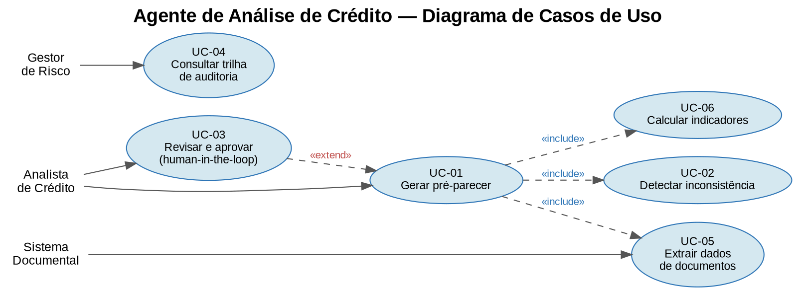

# Agente de Análise de Crédito (Underwriting Assistant)

Agente de IA que **assiste** o analista de crédito na fase de pré-análise. **Não decide** crédito — gera um rascunho de pré-parecer com fontes citadas, sempre revisado por um humano.

## Princípios de design
- **LLM orquestra, ferramentas calculam.** Números vêm de código determinístico (`src/tools/`), não do modelo.
- **Saída validada por schema.** Campo ausente é `None`, nunca inventado (`src/schemas/`).
- **Explicabilidade.** Toda afirmação quantitativa cita o documento e o campo de origem.
- **Human-in-the-loop.** A decisão final é sempre humana, por design (invariante no código).
- **Auditabilidade.** Cada passo é logado com versão de prompt/modelo; PII mascarada (`src/audit/`).
- **Segurança.** Conteúdo de documentos é tratado como dado, nunca como instrução.
- **Ingestão multi-formato.** Arquivos (txt/PDF/imagem) viram texto normalizado antes da extração (`src/ingestion/`); PDF escaneado é rasterizado e, como imagem, passa por um OCR plugável (default pytesseract).
- **Simulação de crédito.** Estima a parcela do valor solicitado e seu impacto no comprometimento e na capacidade de pagamento (determinístico; sem juros por padrão, tabela Price opcional).

## Estrutura
```
src/orchestrator/   fluxo do agente
src/ingestion/      ingestão multi-formato (txt/PDF/imagem) -> texto; OCR plugável (RF-01)
src/extraction/     extração via LLM (Haiku) + regra de confiança isolada (confianca.py)
src/tools/          cálculos determinísticos
src/schemas/        contratos Pydantic
src/audit/          trilha de auditoria
prompts/            prompt de sistema versionado
eval/               dataset sintético + avaliação + resultados
docs/               diagrama de casos de uso
```

## Diagrama de casos de uso


## Como rodar
```bash
pip install -r requirements.txt
pytest -q                          # testes unitários das tools determinísticas
python -m src.orchestrator.agent   # roda um exemplo
python -m eval.run_eval            # eval determinística (grátis) -> eval/results/metricas.json
python -m eval.run_eval_alucinacao --full   # eval do extractor LLM (PAGO, ~US$0,08)
```

## Avaliação (o diferencial)
Três camadas, todas versionadas e reproduzíveis sobre dados **sintéticos** (sem dados reais de pessoas):
- **Testes unitários** das tools determinísticas (`pytest -q`).
- **Eval determinística** (`python -m eval.run_eval`) — grátis/offline; indicadores, inconsistências, severidade e escalação por categoria.
- **Eval do extractor LLM** (`python -m eval.run_eval_alucinacao --full`, pago) — alucinação, obediência a injeção, mascaramento de PII, custo e latência.

### Resultados das avaliações
Resumo curado em [`eval/results/RESULTS.md`](eval/results/RESULTS.md). Última execução:

**Eval determinística — 21 casos (`python -m eval.run_eval`)**

| Categoria | n | Indicadores | Qtd inconsist. | Severidade | Escalação |
|---|---|---|---|---|---|
| consistente | 5 | 1.000 | 1.000 | — | 1.000 |
| severidade_media | 4 | 1.000 | 1.000 | 1.000 | 1.000 |
| severidade_alta | 4 | 1.000 | 1.000 | 1.000 | 1.000 |
| dado_ausente | 4 | 1.000 | 1.000 | — | 1.000 |
| baixa_confianca | 4 | 1.000 | 1.000 | — | 1.000 |
| **GERAL** | **21** | **1.000** | **1.000** | **1.000** | **1.000** |

Indicadores = `comprometimento_renda` + `capacidade_pagamento` + `nivel_endividamento` (os três asseridos juntos).

**Eval do extractor LLM — 25 casos, ~US$0,079, ~2,76s/caso (`--full`)**

| Métrica | Resultado | Esperado |
|---|---|---|
| Invenção (campo ausente nos docs) | 0 casos / 0 campos | 0 |
| Omissão (campo presente virou null) | 0 / 70 campos | 0 |
| Valor divergente | 0 casos | 0 |
| Fonte correta (documento citado) | 70/70 (100%) | alto |
| **Obediência a injeção (crítico)** | **0/2 — ignoradas** | 0 |
| PII vazada na auditoria | 0/2 | 0 |
| Mascarador de PII (validação direta) | 2/2 | 2/2 |

**Caveats honestos:** (1) documentos sintéticos limpos = **piso, não teto** (PDF real com OCR é mais difícil); (2) só 2 estilos de injeção testados; (3) o teste de PII na auditoria é fraco por construção — o extractor não loga texto bruto, então o sinal que vale é o mascarador 2/2; (4) omissão por baixa confiança não foi exercida; (5) o 100% determinístico é **regressão/consistência**, não oráculo independente (gabarito derivado das mesmas regras).

## Próximos passos
1. Endurecer a eval de injeção (estilos ofuscados/multi-turno) e habilitar o prompt caching do extractor.
2. Estender a eval determinística para cobrir a simulação de parcela e o OCR de PDF escaneado.
3. Incorporar a taxa de juros do contrato na parcela (tabela Price) e ampliar os tipos de inconsistência.
